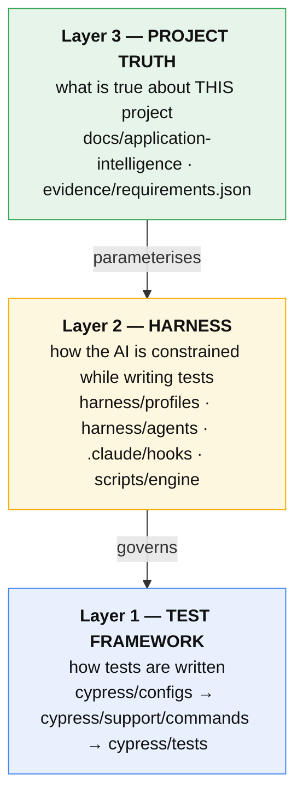
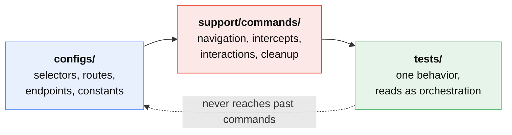
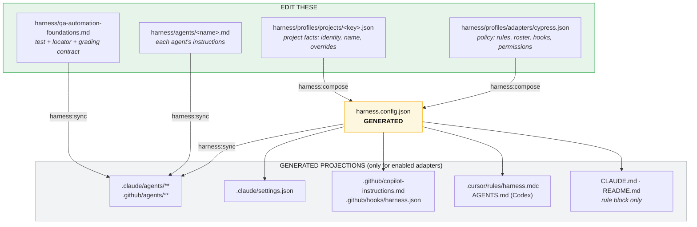
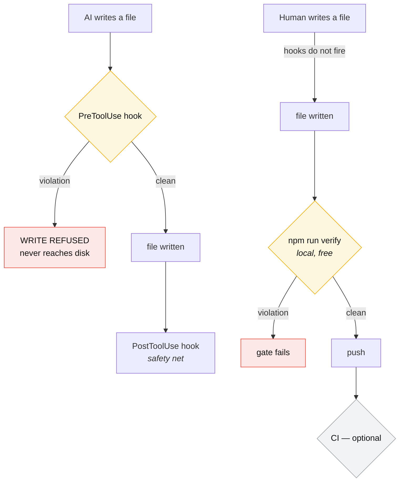
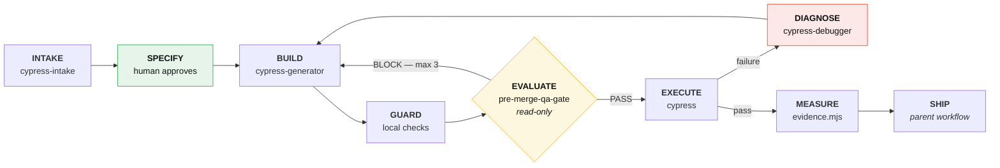
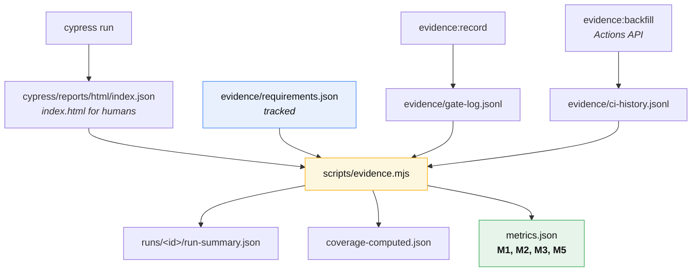

# Start Here — The Complete Cypress Harness Guide

This repository is the **reference instantiation** of the Cypress AI harness. It ships harness
policy plus a small Automation Exercise `products` module: two active requirements
(`AE-PRODUCTS-001`, `AE-PRODUCTS-002`), configs, commands, and smoke specs. The lifecycle below is
how you extend it — or how a fork starts a new project from a blank profile.

Agents still must not invent application facts. Verified behavior lives in
`docs/application-intelligence/**` and `evidence/requirements.json`.

This is the only document you need. It is self-contained.

|                  |                                        |
| ---------------- | -------------------------------------- |
| **Adapter**      | Cypress                                |
| **Architecture** | Config → Commands → Tests              |
| **Spec glob**    | `cypress/tests/**/*.cy.{js,ts}`        |
| **Language**     | JavaScript, TypeScript opt-in per file |
| **Rules**        | 9 — 8 blocking, 1 graded               |
| **Agent roles**  | 4                                      |

---

## 1. Architecture — three layers

The harness is not a test framework. It governs one.



Layer 1 is framework-native on purpose. Layer 2 is the same design in the Playwright adapter. Layer 3
is the only thing a new project authors.

### 1.1 The dependency rule



A spec that reaches straight for a selector has skipped a layer, and `no-hardcoded-selector` refuses
the write.

---

## 2. Installation

### 2.1 Prerequisites

- Node.js 22+ and npm
- Git
- **No paid service is required.** Cypress Cloud and any tracker integration are optional
  enhancements, never baseline dependencies.

### 2.2 Install

```bash
npm ci
```

### 2.3 Verify this reference clone

This is the acceptance test for a correct installation.

```bash
npm run verify
```

That chain is `harness:check` → `harness:ready` → `harness:test` → `harness:format:check` → `check:rules` →
`check:requirements` → `typecheck` → `npm test` (with `lint` via `pretest`) → `evidence:build`.
Run them individually to isolate a failure.

Expected for this repository (two products smoke specs):

```text
[evidence] ... status ready (or equivalent coverage for AE-PRODUCTS-001 / AE-PRODUCTS-002)
```

`npm test` launches Cypress against the public Automation Exercise target. If verify fails before
you change anything, the installation or network path is broken — do not start new intake.

For a **brand-new empty profile** (zero requirements / zero tests), the runner prints
`[cypress] No all specs yet; bootstrap state is valid.` and evidence reports `bootstrap` with
unavailable metrics — that empty state is still correct for intake.

### 2.4 Starting a brand-new project from zero

Do not hand-write `harness.config.json`; it is generated. Write an ~8-line profile and compose it.

Paste [`harness/profiles/configure.prompt.md`](../harness/profiles/configure.prompt.md) into your AI,
or copy the template by hand:

```bash
cp harness/profiles/projects/_template.json harness/profiles/projects/<key>.json
```

```bash
npm run harness:compose && npm run harness:sync && npm run harness:check && npm run harness:lock
```

You now have the full four-role roster, every rule enforced at write time, enabled AI adapters
wired, and Cypress skills projected to `.claude/skills` + `.agents/skills`. A brand-new profile has
no tests yet; this repository's `cypress-boilerplate` profile is already a reference instantiation
with products smoke coverage. See [`harness/profiles/README.md`](../harness/profiles/README.md) and
[cross-tool-configuration.md](architecture/cross-tool-configuration.md).

After compose/sync, refresh or confirm skills:

```bash
npm run harness:skills -- --list
```

```bash
npm run harness:skills   # only when refreshing the canon from upstream
```

There is **no** project-profiles report builder. `output/` stays gitignored.

### 2.5 Environment and secrets

Never commit a credential. `no-credential-literal` blocks literals at write time.

| Where                                               | What                         |
| --------------------------------------------------- | ---------------------------- |
| `cypress.env.json` (**gitignored**)                 | local secrets                |
| `cy.env(['KEY'])`                                   | how a test reads them        |
| `cypress/environments/cypress.env.*.json` (tracked) | **non-secret settings only** |
| CI secret store                                     | secrets in the pipeline      |

```bash
cp cypress.env.example.json cypress.env.json
```

---

## 3. Configuration — four hand-edited files, two generation stages



Four AI tools are supported — Claude Code, Copilot, Cursor, Codex — and each project's profile enables
the subset the team uses. Disabling one deletes its projection on the next sync. The full per-tool
hook and enforcement matrix is in
[cross-tool-configuration.md](architecture/cross-tool-configuration.md).

After any policy change:

```bash
npm run harness:compose && npm run harness:sync && npm run harness:check && npm run harness:lock
```

Two independent drift checks, both inside `npm run verify`:

| Check                                        | Catches                                            |
| -------------------------------------------- | -------------------------------------------------- |
| `harness:profile:verify` (in `harness:test`) | `harness.config.json` edited away from its profile |
| `harness:check`                              | any projection edited away from the config         |

Generated files are **not** prettier-formatted, deliberately: prettier realigns the generated rule
table and collapses arrays that `JSON.stringify` expands, so formatting an artifact makes its
generator report drift. `.prettierignore` shields them; the format gate checks the sources.

### 3.1 Memory is the one layer that is not reproducible

`.claude/settings.json` sets `autoMemoryEnabled: true` — which is also the schema default, so the line
documents intent rather than changing behaviour. Memory accumulates in
`~/.claude/projects/<project>/memory/`, and `autoMemoryDirectory` is deliberately left unset.

That means memory is **per machine and per person**. It is not committed, not versioned, and not shared:
two engineers on the same project build separate private memory, and a fresh clone starts with none.

This is called out because everything else here is derived from config and reproducible — agents,
rules, hooks, evidence, metrics. Memory is the exception, and it would be easy to assume otherwise.
It is left that way on purpose: auto-memory captures one person's session, and committing that to a
repo every teammate clones would be the wrong default. Nothing in the harness depends on it.

### 3.2 What the config owns

| Key                    | Owns                                                                                                    |
| ---------------------- | ------------------------------------------------------------------------------------------------------- |
| `framework`, `project` | adapter, paths, architecture, spec glob                                                                 |
| `adapters`             | which AI tools get projections (claude/copilot/cursor/codex)                                            |
| `context`, `loops`     | model effort; `gateRepairLimit`                                                                         |
| `rules[]`              | `id`, `severity`, `never`, `instead`, `why`, `message`                                                  |
| `agents[]`             | `name`, `role`, `model`, `tools`, `when`                                                                |
| `hooks`                | which hook script runs on which event                                                                   |
| `skills[]`             | pinned trees under `harness/skills/**` with `roles[]`; projected to `.claude/skills` + `.agents/skills` |
| `permissions`          | `defaultMode: plan`, allow/deny lists                                                                   |

**To add a rule:** append to `rules[]` in the adapter baseline, compose, sync. It appears in
`CLAUDE.md`, `README.md`, and `copilot-instructions.md` automatically. For write-time blocking, add
its pattern to `.claude/hooks/shared-rules.mjs` — engine code, not a projection.

---

## 4. Enforcement — what actually stops a violation

**CI is a backstop, not the enforcement point.** The harness never requires a paid service.



| Enforcement                        | Runs                    | Cost                                     | Blocks?                     |
| ---------------------------------- | ----------------------- | ---------------------------------------- | --------------------------- |
| `PreToolUse` / `PostToolUse` hooks | locally, in Claude Code | free                                     | **yes — refuses the write** |
| `npm run verify`                   | locally                 | free                                     | yes, on demand              |
| CI                                 | hosted runners          | free on public repos; metered on private | backstop only               |

Blocking hooks fire only in Claude Code sessions — Copilot, Cursor, and Codex have no pre-edit block
(see [cross-tool-configuration.md](architecture/cross-tool-configuration.md)), so the floor below is
their real gate, and CI catches **human-authored** code too. Without CI, run the same gates before
every push — no dependency, just core git:

```bash
git config core.hooksPath .githooks
```

`SKIP_VERIFY=1 git push` bypasses it deliberately.

Every rule is enforced identically in `.js`, `.ts`, `.mjs`, `.mts`, `.cjs`, and `.cts`.
`scripts/engine/test-rule-extensions.mjs` asserts the same violating spec yields the **same count**
in all six. That test exists because it was once false: a `.cy.ts` spec with five violations produced
zero findings, so TypeScript looked like it worked while silently disabling the guardrail.

### 4.1 The rules

| Rule                    | Severity | Why it exists                                                              |
| ----------------------- | -------- | -------------------------------------------------------------------------- |
| `no-hard-wait`          | block    | A fixed wait masks the real timing bug and fails on slower CI.             |
| `no-hardcoded-selector` | block    | One app change should mean one config edit, not 50 spec edits.             |
| `no-hardcoded-route`    | block    | Routes change; a central registry keeps every caller correct.              |
| `no-page-object`        | block    | Commands _are_ the page methods; a second layer duplicates ownership.      |
| `require-auth-command`  | block    | Session setup belongs in one place, not repeated per test.                 |
| `no-credential-literal` | block    | Trust boundary. A committed credential is a breach, not a style issue.     |
| `smoke-read-only`       | block    | Smoke runs against shared and production-like environments.                |
| `search-before-create`  | graded   | Duplicate owners are the most common review failure.                       |
| `one-requirement-tag`   | block    | The title survives every reporter; together they make coverage computable. |

Legitimate exceptions go in `.claude/hooks/cypress-hook-allowlist.json` with a justification in
`cypress-hook-allowlist-governance.md` — never by weakening a rule.

`search-before-create` remains graded because deciding whether an existing owner should be reused
needs repository-level analysis. Requirement/Type/Priority/tier tag shape is deterministic, so
`one-requirement-tag` is blocked by the write hook and CI; `check:requirements` separately verifies
that spec ids are active and are not redefined versus the base branch. The locator contract in
`harness/qa-automation-foundations.md` remains graded because a regex cannot judge locator intent
without false positives.

---

## 5. The lifecycle



INTAKE folds context-gathering and application discovery into one agent. SHIP (opening the PR) and
harness maintenance are handled by whoever drives the workflow — a human or the parent agent — not by
dedicated agents.

The `EVALUATE → BUILD` repair loop carries a declared bound, `loops.gateRepairLimit` (3), and it is
worth being precise about what that is: **an instruction, not a counter.** The limit is validated when
the config is generated and injected into the BUILD and EVALUATE agent bodies, but no code counts
attempts — the harness does not orchestrate the loop, so there is no runtime to enforce it in.

It is observable after the fact rather than prevented: `evidence/gate-log.jsonl` records `attempt` on
every row, and M1 counts only `attempt: 1`, so a loop that ran away shows up in the ledger. If you want
it prevented rather than recorded, the enforcement point is whatever drives the loop — a human, or CI.

### 5.1 The roster

The roster is a set of bounded routes, not four agents to invoke for every change. Use the parent
workflow for routine work and invoke only the specialist whose `when` condition matches: INTAKE once
per new project/module or when application behavior is unknown, and DIAGNOSE only after a reproducible
failure. BUILD and the independent read-only EVALUATE gate are the normal test-authoring separation.
Invoke at most one specialist per task. This keeps the safety boundary without paying the coordination
cost of a ceremonial multi-agent pipeline.

| Role     | Agent               | Model  | Why it is separate                                                         |
| -------- | ------------------- | ------ | -------------------------------------------------------------------------- |
| INTAKE   | `cypress-intake`    | sonnet | Verified context, requirements, and observed config before any test exists |
| BUILD    | `cypress-generator` | sonnet | Owns authoring for exactly one requirement                                 |
| DIAGNOSE | `cypress-debugger`  | opus   | Root cause + compliant fix; hardest reasoning                              |
| EVALUATE | `pre-merge-qa-gate` | opus   | **Read-only. A builder must never grade its own output.**                  |

Shipping the PR and maintaining the harness are not agents — the parent workflow (a human or the
driving agent) owns them, using `npm run verify` and the standard PR template directly.

`pre-merge-qa-gate` has `permissionMode: plan` and `tools: [Read, Grep, Glob]` — no Write, no Bash.
That restriction is the entire reason the gate is trustworthy, and it is **declared in config**, not
requested in a prompt. `harness:profile:test` asserts it.

### 5.2 Source precedence

When two sources disagree, the agent stops and reports the conflict. It does not guess.

1. `harness.config.json` — roles, tools, limits, rules
2. `harness/qa-automation-foundations.md` — test, locator, and grading contract
3. `evidence/requirements.json` — approved requirements
4. `docs/application-intelligence/**` — verified project behavior
5. `cypress/configs/**` — selectors, routes, API contracts
6. `cypress/support/commands/**` — reusable implementation
7. `cypress/tests/**` — thin orchestration

---

## 6. Step by step

### Step 0 — Verify the empty state

Section 2.3. Do not skip it.

### Step 1 — INTAKE: verified project context

Invoke `cypress-intake`:

```text
Start project intake for <project>.
Application source: <repository path or URL>
Requirement source: <tracker/specification/owner>
Known environments: <dev/qa/staging/prod>
AI tools the team will use: <any of claude, copilot, cursor, codex>
Do not generate tests. Record unknowns and stop for approval where safety or expected behavior is unclear.
```

It writes `docs/application-intelligence/project-context.md` and
`docs/application-intelligence/<module>/module-context.md` from the templates in `_template/`.

**The hard rule:** the agent may not invent an application, requirement, selector, route, credential,
or expected result. Every claim is source-linked; an unavailable fact is recorded as unknown, not
filled in.

Never put credentials, PII, payment data, or production records in these files.

**Record the tool answer in the profile.** Which AI tools a team uses is a project fact, so it lives
at the top level of `harness/profiles/projects/<key>.json`:

```json
"adapters": {
  "claude": { "enabled": true },
  "copilot": { "enabled": false },
  "cursor": { "enabled": true },
  "codex": { "enabled": false }
}
```

Then `npm run harness:compose && npm run harness:sync`. Disabling an adapter **deletes its generated
files** — a Claude-only team stops carrying `.github/agents/`, `copilot-instructions.md`,
`.github/hooks/harness.json`, `.cursor/rules/`, and `AGENTS.md` for tools it never opens. At least one
adapter must stay enabled; composing with none is refused, because it would emit a config whose rules
reach no tool at all.

Claude Code, Copilot, and Cursor can refuse a violating write through their generated pre-tool hooks.
Codex has no equivalent hook API, so its real gate is `npm run verify` and the pre-push hook (§4).
Those floor checks still cover human edits and anything a tool hook misses. Run
`npm run harness:skills` to install the pinned official Cypress skills into whichever tools are
present. Full detail: [cross-tool-configuration.md](architecture/cross-tool-configuration.md).

Do not proceed until the owner approves environment mutation rules, authentication, selector strategy,
synthetic data creation and cleanup, and at least one module contract.

### Step 2 — SPECIFY and approve requirements

The agent drafts; **a human promotes to `active`**. Nothing is built from a draft.

Use [`application-intelligence/requirement-authoring-guide.md`](application-intelligence/requirement-authoring-guide.md) (prompt + field
rules) and [`_template/requirement.example.json`](application-intelligence/_template/requirement.example.json).
The registry is only `evidence/requirements.json` — do not create a parallel test-plan tree.

```json
{
  "version": 1,
  "requirements": [
    {
      "id": "PAY-CHECKOUT-001",
      "status": "active",
      "module": "checkout",
      "title": "Registered user completes checkout with a saved card",
      "expectedOutcome": "Order confirmation shows the order number",
      "source": "docs/application-intelligence/checkout/module-context.md#happy-path",
      "acceptanceCriteria": ["Confirmation number is displayed"],
      "preconditions": ["A registered user with one saved card"],
      "type": "SMOKE",
      "priority": "P0",
      "tier": "smoke"
    }
  ]
}
```

`evidence:build` throws if an active requirement is missing any field, has an empty
`acceptanceCriteria` or `preconditions`, or uses a value outside `SMOKE|REGRESSION` / `P0|P1|P2` /
`smoke|e2e|ddt`. Ids must be unique. Automate P0 first; keep unclear items in `draft`.

### Step 3 — Discover selectors, only if they are unknown

`cypress-intake` also owns discovery. When a module's selectors or routes are unknown, have it use
`npm run cy:open` — the Selector Playground and command-log time-travel (Cypress has no `codegen`) —
and capture **config constants only**; writing a command or spec here bypasses the BUILD role. Skip
this step for a module whose config already exists.

### Step 4 — BUILD one requirement

Invoke `cypress-generator` with **exactly one active requirement id**:

```text
Build requirement PAY-CHECKOUT-001. Use the approved application context and run the focused test.
```

It produces, in order:

```text
cypress/configs/ui/modules/<module>/   selectors
cypress/configs/app/routes.js          routes
cypress/configs/api/modules/<module>/  endpoints, if the requirement needs API
cypress/support/commands/              reusable interaction
cypress/tests/<module>/<tier>/         the spec — thin orchestration
```

Every title begins `[REQUIREMENT-ID]` and carries matching requirement, Type, Priority, and tier tags.
That prefix is not cosmetic: it is how coverage is computed, because the Mochawesome JSON does not
preserve Cypress grep tags.

The `block` hooks fire on every write. A hardcoded selector or a `cy.wait(500)` is refused as it is
written, not caught in review.

### Step 5 — GUARD locally

```bash
npm run check:rules && npm run lint && npm run typecheck
```

### Step 6 — EVALUATE with the independent gate

Supply `pre-merge-qa-gate` with the diff and the exact command output from Step 5, plus:

```bash
npm run cy:run:tag -- --env grepTags=@PAY-CHECKOUT-001
```

| Verdict             | Meaning                                                                     |
| ------------------- | --------------------------------------------------------------------------- |
| `PASS`              | merge-ready; no required follow-ups                                         |
| `PASS_WITH_ACTIONS` | merge-ready **now**; named non-blocking follow-ups only                     |
| `BLOCK`             | do not merge; anything that must be fixed first is a blocker, not an action |

`PASS_WITH_ACTIONS` is not "merge after the list is done." If work must complete before merge, the
verdict is `BLOCK`.

The gate scores each changed test from 100 using the rubric in `qa-automation-foundations.md`. **80 is
necessary but not sufficient** — a safety or architecture blocker overrides any score.

Record the verdict afterwards (§7.4); the gate cannot record it itself.

### Step 7 — EXECUTE

```bash
npm run test:smoke
```

```bash
npm run test:e2e
```

Tier discipline: smoke is **read-only** — `smoke-read-only` blocks POST/PUT/PATCH/DELETE, because
smoke runs against shared and production-like environments. Mutations belong in e2e.

- Pull requests: minimal P0 smoke
- Main and nightly: approved regression coverage
- Production: read-only smoke only
- Cypress Cloud: optional — recording activates only when both Cloud secrets exist

### Step 8 — DIAGNOSE a failure

Invoke `cypress-debugger` (opus). A fix that would violate a rule is not a fix, and a test that
passes for the wrong reason is a defect.

### Step 9 — MEASURE

```bash
npm run evidence:build
```

---

## 7. Results, evidence, and metrics



### 7.1 Human report

`cypress/reports/html/index.html` — generated, gitignored, uploaded by CI.

### 7.2 Machine evidence

```text
evidence/
  requirements.json                  TRACKED — the approved registry
  gate-log.jsonl                     TRACKED — M1 input
  ci-history.jsonl                   TRACKED — M2 input
  runs/<run-id>/run-summary.json     generated, gitignored
  coverage-computed.json             generated, gitignored
  metrics.json                       generated, gitignored
```

`run-summary.json` records per test: `requirement`, `title`, `file`, `status`
(`passed|failed|flaky|skipped`), `durationMs`, `retries` — plus `traceabilityGaps`, every executed
test lacking a requirement id.

`metrics.status` tells you where you are:

| Status      | Meaning                                                     |
| ----------- | ----------------------------------------------------------- |
| `bootstrap` | no active requirements and no tests — the valid empty state |
| `partial`   | tests ran but at least one has no requirement id            |
| `ready`     | every executed test maps to a requirement                   |

### 7.3 The five metrics

| Id     | Metric                          | Source                                              | How it gets fed               |
| ------ | ------------------------------- | --------------------------------------------------- | ----------------------------- |
| **M1** | Accepted-test rate              | `gate-log.jsonl`, first submission only             | `evidence:record gate`        |
| **M2** | First-pass CI rate              | `ci-history.jsonl`, PR + attempt 1, excluding `ENV` | CI step + `evidence:backfill` |
| **M3** | New-test flake rate             | `runs/**` — 5 runs on one unchanged commit, 30 days | automatic, accrues            |
| **M4** | QA effort per accepted scenario | `effort-log.jsonl`                                  | `evidence:effort`             |
| **M5** | Requirement-to-test coverage    | active requirements vs latest run                   | **fully automatic**           |

M4 is manual input and remains unavailable until accepted effort is appended. Use it only for the
same accepted requirement recorded in M1; M5 keeps its stable identifier across history.

**Unavailable is never zero.** A metric with no input returns `null` with a `reason`:

```json
{
  "M1": {
    "value": null,
    "status": "unavailable",
    "reason": "No first-submission gate evidence"
  }
}
```

A `0%` accepted-test rate and "no gate evidence yet" are different facts. Reporting the second as the
first destroys the ledger's credibility — the exact failure this harness exists to fix.

### 7.4 Recording M1, M2, and M4

```bash
npm run evidence:record -- gate --requirement PAY-CHECKOUT-001 --attempt 1 --verdict PASS
```

```bash
npm run evidence:record -- gate --requirement PAY-CHECKOUT-001 --attempt 1 \
  --verdict PASS_WITH_ACTIONS \
  --actions "docs: align CI artifact names|chore: remove obsolete allowlist entry" \
  --resolution "tracked in maintainer backlog"
```

`PASS` and `PASS_WITH_ACTIONS` both count as accepted for M1. Named `--actions` (pipe-separated) are
required for `PASS_WITH_ACTIONS`, preserved on the gate ledger row, and copied into
`metrics.json` as `gateFollowUps`. Optional `--resolution` is a short human note, not a second
verdict.

```bash
npm run evidence:record -- ci --pipeline 4242 --trigger pr --attempt 1 --outcome passed
```

```bash
npm run evidence:effort -- --requirement PAY-CHECKOUT-001 --minutes 45
```

Validation is the point. An unknown requirement id or an out-of-range verdict would **not** crash
`evidence.mjs` — it would silently drop the row and understate the metric. Both are refused at write
time, as is a duplicate `gate` or `ci` row for the same id and attempt (`--force` overrides).

**Only `attempt: 1` counts** toward M1 and M2. Measuring after repairs measures persistence, not
quality. `--failure-class ENV` on a failed CI row keeps an infrastructure outage from counting as a
test failure.

**Record the gate verdict from outside the gate.** `pre-merge-qa-gate` has no Write and no Bash by
design, so the thing being measured never writes its own scorecard. Its accepted verdict now outputs
the exact append command; run it once for each accepted requirement.

### 7.5 Durable M2

CI records its own row, but a job writes to a **throwaway checkout** — the row reaches the artifact,
not the tracked ledger. Worse, a job that never _starts_ records nothing, because the recorder is
itself a step. Backfill is the only mechanism that sees both:

```bash
npm run evidence:backfill -- --limit 100
```

Idempotent — re-running over an overlapping window skips rows already present. `--dry-run` previews. A
run whose jobs executed zero steps is classified `ENV`.

---

## 8. CI

Optional when Actions is available. Gates on the same commands you run locally:

```yaml
- run: npm ci
- run: npm run harness:check
- run: npm run harness:test # self-tests + profile drift
- run: npm run check:rules
- run: npm run lint
- run: npm run test:smoke # read-only tier on PR
- run: npm run evidence:record -- ci --pipeline ... --trigger pr --attempt ... --outcome ...
- run: npm run evidence:build
```

Then upload the HTML report, screenshots (on failure), and `evidence/`. Videos are off
(`video: false` in `cypress.config.js`) unless you deliberately enable them. Recommended split when
automatic triggers are active: **smoke on PR, full e2e on main.** Set `TEST_TIER` and `RUN_TRIGGER`
so the run summary records which lane produced the evidence.

### GitHub Actions prerequisite

Both `cypress.yml` and `cypress-rules.yml` run automatically for their configured pull-request and
push triggers. GitHub must be able to allocate Actions runners; a job that fails before any step runs
is account infrastructure evidence, not a Cypress test result.

Resolve the GitHub account billing or Actions entitlement before treating green PR checks as available.
A self-hosted runner is an alternative only when the repository owner deliberately provides one.

---

## 9. TypeScript

Opt-in per file. The framework layer stays JavaScript; write a new spec as `*.cy.ts` and nothing else
changes — same rules, same agents, same gate. `cypress/support/index.d.ts` declares every custom
`cy.*` command, so a TS spec gets real types instead of a cast that discards them.

```bash
npm run typecheck
```

**Add a command, add its declaration in the same change** — a command without a type is invisible to
every TypeScript spec. Full detail: [typescript-guide.md](guides/typescript-guide.md).

---

## 10. Definition of complete

- Project and module contracts approved and source-linked
- Every active requirement has an independently accepted test, or is visibly uncovered
- Tests pass for the intended reason and clean up state they created
- CI retains the human report and machine evidence
- `metrics.json` holds computed values or explicit, reasoned gaps
- Optional paid integrations remain enhancements, never baseline dependencies

---

## 11. Troubleshooting

| Symptom                                        | Cause                                     | Fix                                                       |
| ---------------------------------------------- | ----------------------------------------- | --------------------------------------------------------- |
| `harness:check` fails                          | a projection was hand-edited              | edit the source, then `harness:compose && harness:sync`   |
| `harness:profile:verify` fails                 | config diverged from its profile          | edit the baseline or profile, re-compose                  |
| a write is refused                             | a `block` rule fired                      | read the message; fix the cause, do not weaken the rule   |
| `Report is missing while N test file(s) exist` | tests exist but never ran                 | run the suite before `evidence:build`                     |
| `metrics.status: "partial"`                    | an executed test has no requirement id    | add `[REQUIREMENT-ID]`; check `traceabilityGaps`          |
| M1/M2 always `null`                            | the JSONL ledgers are empty               | §7.4 — nothing appends them automatically                 |
| M2 resets every run                            | CI wrote to a throwaway checkout          | §7.5 — use `evidence:backfill`                            |
| M3 `null` with run history                     | fewer than 5 runs on one unchanged commit | keep running; it accrues                                  |
| `Unknown requirement "X"`                      | id not in `requirements.json`             | fix the id — the recorder refuses rows metrics would drop |
| `Duplicate gate entry`                         | already recorded for that id and attempt  | intended; a second append inflates M1                     |
| active requirement rejected                    | a required field is missing or invalid    | the error names the field                                 |
| `npm run format` broke a gate                  | you formatted a generated file            | it belongs in `.prettierignore`; re-sync                  |

---

## 12. Further reading

This guide is self-contained; the documents below are supporting detail, indexed in
[docs/README.md](README.md).

| When you need                              | Document                                                                                                           |
| ------------------------------------------ | ------------------------------------------------------------------------------------------------------------------ |
| TypeScript detail and the conversion path  | [typescript-guide.md](guides/typescript-guide.md)                                                                  |
| Hook events, adding a rule, the allowlist  | [hooks-explainer.md](guides/hooks-explainer.md)                                                                    |
| Writing custom commands                    | [support-commands-instructions.md](guides/support-commands-instructions.md)                                        |
| The API config layer and intercepts        | [api-layer-guide.md](reference/api-layer-guide.md)                                                                 |
| Why configs, commands, and tests are split | [test-organization.md](reference/test-organization.md)                                                             |
| Framework standards in full                | [framework-standards.md](reference/framework-standards.md)                                                         |
| The lifecycle contract as a spec           | [harness-lifecycle-spec.md](architecture/harness-lifecycle-spec.md)                                                |
| How one policy reaches all four AI tools   | [cross-tool-configuration.md](architecture/cross-tool-configuration.md)                                            |
| Adding or updating modules                 | [framework-maintenance-guide.md](guides/framework-maintenance-guide.md)                                            |
| CI pipeline setup in detail                | [ci-cd-guide.md](guides/ci-cd-guide.md)                                                                            |
| Project and module context templates       | [application-intelligence](application-intelligence/README.md)                                                     |
| Requirement authoring guide                | [application-intelligence/requirement-authoring-guide.md](application-intelligence/requirement-authoring-guide.md) |
| Profile configure prompt                   | [../harness/profiles/configure.prompt.md](../harness/profiles/configure.prompt.md)                                 |
| Why the architecture is what it is         | [decisions](decisions/README.md)                                                                                   |
| Composing a config from a profile          | [harness/profiles/README.md](../harness/profiles/README.md)                                                        |

---

## 13. What not to change

- **Framework-native architecture.** Command-first here, helper-first in Playwright. Both correctly
  reject page objects. Forcing one style across both produces worse tests in whichever loses.
- **Gate read-only.** Give `pre-merge-qa-gate` Write or Bash and the builder can grade itself.
- **Unavailable-vs-zero.** Never let a missing input report as `0`.
- **Generated files.** Edit the source and re-run the generator.
- **Extension parity.** Every rule must match every executable extension. Narrowing one silently
  disables the guardrail for that language.
