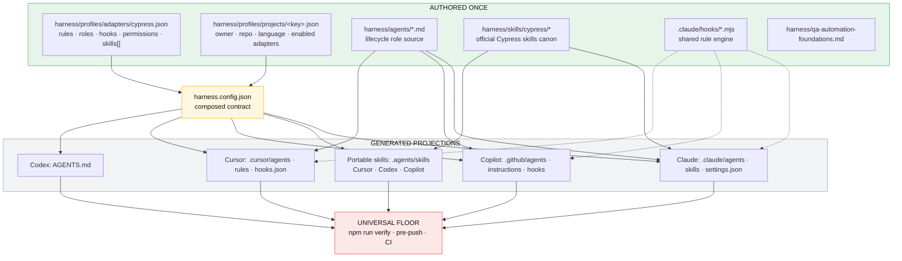

# Cross-Tool Configuration Architecture

How one harness policy reaches four AI coding tools — Claude Code, GitHub Copilot, Cursor, and
Codex — without duplicating a rule, an agent, a skill, or a hook, and without pretending a tool can
enforce something it cannot.

Day-to-day workflow: [`../START-HERE.md`](../START-HERE.md).

---

## 1. Correct relationship

| Component          | Responsibility                                                                         |
| ------------------ | -------------------------------------------------------------------------------------- |
| **Skill**          | Reusable Cypress expertise (how)                                                       |
| **Agent**          | Lifecycle role, permissions, model, inputs, outputs (when / why / constraints)         |
| **Rule**           | Persistent project policy (never / instead)                                            |
| **Hook**           | Deterministic write-time enforcement (Claude / Copilot / Cursor block; Codex has none) |
| **Command/script** | Executable operation (`npm run verify`, engine hooks)                                  |
| **Workflow**       | CI enforcement (universal floor backstop)                                              |
| **Profile**        | Project facts and enabled AI tools                                                     |

Example:

```text
cypress-generator agent
  ├── owns BUILD lifecycle
  ├── consumes one active requirement
  ├── uses cypress-author skill
  └── consults cypress-docs skill
```

The skill knows how to author Cypress. The agent controls when, why, and under what constraints.
`skills[].roles` in the adapter baseline makes that binding explicit; sync injects it into each
projected agent body.

---

## 2. The one rule that shapes everything

> **Author policy once, in the harness. Project it into each tool. Never edit a projection.**

`.claude/`, `.github/`, `.cursor/`, `.agents/skills/`, and `AGENTS.md` are **generated**. Source of
truth: adapter baseline + project profile + `harness/agents/` + `harness/skills/`. Drift checks fail
the build if a generated file is edited by hand.

---

## 3. Complete configuration architecture



### Lifecycle (agentic workflow)

```text
CLONE → npm ci → configure profile → COMPOSE → refresh skills canon → SYNC → drift check → verify
  → INTAKE → SPECIFY (owner approval) → BUILD → GUARD → EVALUATE
  → EXECUTE → DIAGNOSE? → MEASURE → SHIP (parent workflow) → merge → next requirement
```

`verify` on an empty new profile expects bootstrap. This repository's reference clone already has
products specs (smoke + one e2e) — verify runs them.

| Phase    | Agent                           | Skills used                                         |
| -------- | ------------------------------- | --------------------------------------------------- |
| INTAKE   | `cypress-intake`                | `cypress-docs`                                      |
| BUILD    | `cypress-generator`             | `cypress-author`, `cypress-docs`                    |
| EVALUATE | `pre-merge-qa-gate` (read-only) | `cypress-explain`                                   |
| DIAGNOSE | `cypress-debugger`              | `cypress-author`, `cypress-explain`, `cypress-docs` |
| SHIP     | parent workflow (no agent)      | —                                                   |

---

## 4. Per-tool component matrix

| Component    | Claude                           | Copilot                               | Cursor                                     | Codex                   |
| ------------ | -------------------------------- | ------------------------------------- | ------------------------------------------ | ----------------------- |
| Instructions | `CLAUDE.md`                      | `copilot-instructions.md`             | `.cursor/rules/harness.mdc`                | `AGENTS.md`             |
| Agents       | `.claude/agents/**`              | `.github/agents/**`                   | `.cursor/agents/**`                        | roster in `AGENTS.md`   |
| Skills       | `.claude/skills/**`              | via `.agents/skills/**`               | via `.agents/skills/**`                    | via `.agents/skills/**` |
| Hooks        | `settings.json` **blocks write** | `.github/hooks` **PreToolUse denies** | `.cursor/hooks.json` **preToolUse denies** | none                    |
| Real gate    | hook + floor                     | hook + floor                          | hook + floor                               | floor                   |

---

## 5. Universal enforcement floor

```text
Same policy → portable skills → tool-specific projections → one deterministic verification floor.
```

Claude (`PreToolUse`), Copilot (`PreToolUse` / exit 2), and Cursor (`preToolUse` / exit 2) refuse a
violating Write/Edit before disk when the shared hook scripts run. Codex has no hook API. Everyone —
including humans and any missed hook — still shares:

`npm run verify` → git pre-push → CI rule scan + tests

---

## 6. Skills projection strategy

```text
Canonical:  harness/skills/cypress/{cypress-author,cypress-explain,cypress-docs}/
Claude:     .claude/skills/*          (when adapters.claude.enabled)
Portable:   .agents/skills/*          (when copilot OR cursor OR codex enabled)
```

**Do not** also generate `.github/skills`, `.cursor/skills`, or `.codex/skills`. Cursor and Codex
discover `.agents/skills`; Claude uses `.claude/skills`. Two physical projections, not four.

Refresh canon from upstream:

```bash
npm run harness:skills
npm run harness:compose && npm run harness:sync && npm run harness:check
```

---

## 7. Required config shape

```json
"skills": [
  {
    "name": "cypress-author",
    "description": "...",
    "source": "harness/skills/cypress/cypress-author",
    "version": "1.0.1",
    "upstream": "cypress-io/ai-toolkit",
    "roles": ["BUILD", "DIAGNOSE"]
  }
],
"adapters": {
  "claude":  { "enabled": true },
  "copilot": { "enabled": true },
  "cursor":  { "enabled": true },
  "codex":   { "enabled": true }
}
```

---

## 8. Recommended canonical repository structure

```text
harness/                           # policy canon (authored)
  profiles/adapters/cypress.json
  profiles/projects/_template.json | <project>.json
  profiles/configure.prompt.md
  agents/*.md
  skills/cypress/{cypress-author,cypress-explain,cypress-docs}/
  qa-automation-foundations.md

scripts/engine/                    # projection engine (not the same as harness/)
  templates.mjs · sync.mjs · check-drift.mjs · skills.mjs

.claude/hooks/*.mjs                # shared rule-engine scripts (authored)

# Generated
.claude/agents/ · skills/ · settings.json
.agents/skills/
.github/agents/ · hooks/ · copilot-instructions.md
.cursor/agents/ · rules/ · hooks.json
AGENTS.md
```

---

## 9. Correct configuration sequence

The setup order (configure profile → compose → skills → sync → drift check → verify) and the full
per-requirement lifecycle (GATHER/INTAKE → SPECIFY → BUILD → GUARD → EVALUATE → EXECUTE → DIAGNOSE →
MEASURE → SHIP) are documented once in [`../START-HERE.md`](../START-HERE.md) §2.4 and §6. This page
is not the second copy — follow START-HERE for the steps and return here for the per-tool projection
detail above.
