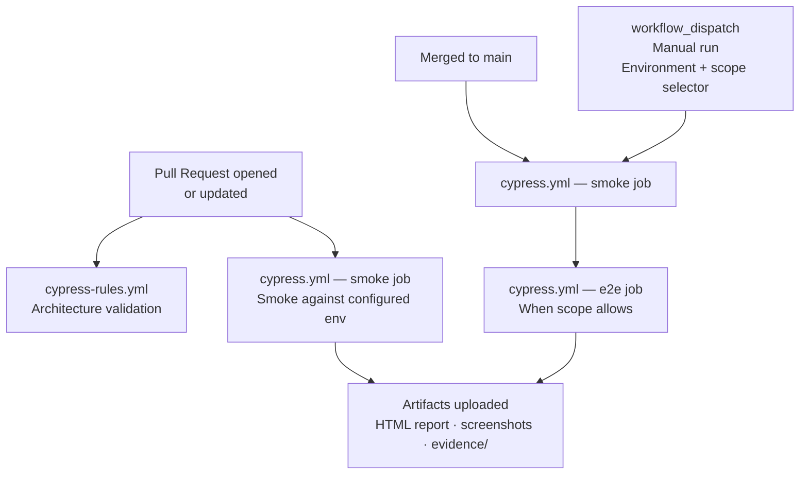

# CI/CD Guide

> **This is an operations doc.** It covers how the pipelines work, how to configure them, how to read results, and how to adapt from GitHub Actions to AWS CodeBuild.

---

## Current status — Actions prerequisite

Automatic checks are enabled. GitHub must be able to allocate Actions runners for them to execute.

| Workflow           | File                | Active trigger                                    |
| ------------------ | ------------------- | ------------------------------------------------- |
| Cypress Tests      | `cypress.yml`       | `pull_request`, `push` to `main`, manual dispatch |
| Architecture Rules | `cypress-rules.yml` | path-filtered `pull_request`, manual dispatch     |

If GitHub fails a job before any workflow step starts, that is runner/account infrastructure evidence,
not a Cypress test result. Resolve the account billing or Actions entitlement before relying on PR checks.

---

## Pipeline Overview

| Workflow           | File                        | What it checks                                            | Blocks merge?                           |
| ------------------ | --------------------------- | --------------------------------------------------------- | --------------------------------------- |
| Architecture Rules | `cypress-rules.yml`         | Non-negotiable framework rules + harness self-tests       | Yes — when automatic PR runs are active |
| Cypress Tests      | `cypress.yml` — smoke / e2e | Smoke (and optional e2e) against the selected environment | Yes — tests must pass                   |

Today, only the **Manual** path in that diagram is live.

---

## Required GitHub Secrets

Set these in **Repository Settings → Secrets and variables → Actions**:

| Secret name          | What it is                                                                                        |
| -------------------- | ------------------------------------------------------------------------------------------------- |
| `BASE_URL`           | Target app URL (optional override; public Automation Exercise default is baked into the workflow) |
| `CYPRESS_USERNAME`   | Test user login                                                                                   |
| `CYPRESS_PASSWORD`   | Test user password                                                                                |
| `CYPRESS_AUTH_URL`   | Auth endpoint (e.g. `/api/auth/login`)                                                            |
| `CYPRESS_PROJECT_ID` | Cypress Cloud project id (optional; required only for recording)                                  |
| `CYPRESS_RECORD_KEY` | Cypress Cloud record key (optional secret; required only for recording)                           |

Create one set of secrets per environment using **GitHub Environments** when you need private targets:

- `dev` environment → dev secrets
- `qa` environment → qa secrets
- `prod` environment → prod secrets (read-only, smoke only)

> Never put credentials directly in workflow files. Always use `${{ secrets.NAME }}`.

---

## Running Tests Manually

Use the **workflow_dispatch** trigger (the only trigger while billing is locked):

1. Go to **Actions → Cypress Tests → Run workflow**
2. Select environment: `dev`, `qa`, or `prod`
3. Select scope: `smoke`, `e2e`, or `all`
4. Click **Run workflow**

Prod environment only runs smoke — the E2E job is skipped automatically.
Architecture rules: **Actions → Cypress Architecture Rules → Run workflow**.

Both workflows pin **Node.js 22**.

---

## Reading Test Results

### Artifacts

Every run uploads artifacts (pass or fail) when the upload step runs. Find them in
**Actions → [run] → Artifacts**:

| Artifact                  | Contains                                                     | Retention |
| ------------------------- | ------------------------------------------------------------ | --------- |
| `smoke-evidence-{run_id}` | `cypress/reports/html/`, `cypress/screenshots/`, `evidence/` | 14 days   |
| `e2e-evidence-{run_id}`   | Same paths for the e2e job                                   | 14 days   |

Videos are **not** produced or uploaded: `cypress.config.js` sets `video: false`. Failure diagnosis
uses screenshots (when captured) plus the Mochawesome HTML/JSON report. Enable video only if you
accept the artifact size and update this guide and the workflow `path:` list together.

### Reading a Mochawesome report

Download the artifact, open `reports/html/index.html` (path inside the artifact) in a browser.
Failed tests show the error, the command that failed, and a screenshot if one was captured.

### Cypress Cloud (optional)

Cypress Cloud is not required. `npm run cy:run` and the CI jobs run without contacting Cypress Cloud
when the two Cloud secrets are absent.

Recording activates only when both `CYPRESS_PROJECT_ID` and `CYPRESS_RECORD_KEY` are configured.
The record key must remain an operating-system/CI secret; do not place it in `cypress.env.json`.
For an explicit local or custom-CI recording, run `npm run cy:run:cloud`.

---

## Environment → Branch Mapping (intended)

| Branch / trigger               | Environment | Scope       |
| ------------------------------ | ----------- | ----------- |
| Any PR (when restored)         | `dev`       | Smoke       |
| Push to `main` (when restored) | `qa`        | Smoke + E2E |
| Manual `prod`                  | `prod`      | Smoke only  |
| Manual `dev` / `qa`            | selected    | Selectable  |

---

## Adding a New Environment

1. Create the environment config: `cypress/environments/cypress.env.[name].json`
2. Add a GitHub Environment: Settings → Environments → New environment
3. Add secrets to the new environment
4. Add the environment name to the `workflow_dispatch` options in `cypress.yml`

---

## Debugging a CI-Only Failure

| Cause                               | How to diagnose                                                                           |
| ----------------------------------- | ----------------------------------------------------------------------------------------- |
| Wrong environment URL               | Check `BASE_URL` secret matches the target env                                            |
| Missing secret                      | Check the workflow log for `undefined` or empty values in `cypress.env.json`              |
| Timing on slow CI                   | Check if `cy.apiWait()` is used — CI machines are slower than local                       |
| Auth failure                        | Check `CYPRESS_AUTH_URL` and credential secrets are set for the correct environment       |
| Intercept fired before registration | Check command order: `cy.apiIntercept()` must be before `cy.visit()`                      |
| Job never started                   | Billing lock or Actions disabled — infrastructure, not a test failure (`ENV` in evidence) |

Steps:

1. Download the evidence artifact — open the HTML report and any screenshots
2. Run the spec locally against the same environment: `npm run cy:run -- --env configFile=qa --spec "path/to/spec"`
3. Use the `cypress-debugger` agent with the error message and recent changes

---

## Adapting to AWS CodeBuild

Translate the same steps into a `buildspec.yml`:

- Branch → environment mapping
- AWS Secrets Manager credential loading instead of GitHub Secrets
- Optional Cypress Cloud recording
- Report + evidence upload to your chosen store

| Concern      | GitHub Actions                   | AWS CodeBuild                           |
| ------------ | -------------------------------- | --------------------------------------- |
| Secrets      | GitHub Secrets per environment   | AWS Secrets Manager                     |
| Parallelism  | Separate jobs                    | Single instance or split workers        |
| Test results | HTML + evidence artifact         | Upload to your reporting tool of choice |
| Trigger      | Webhook (when enabled) or manual | CodeBuild webhook or manual             |

---

## Architecture Validation in CI

`cypress-rules.yml` runs `harness:check`, `harness:test`, and `check:rules` — the same rule scanner
as the local pre-write hooks under `.claude/hooks/` (also projected for Copilot and Cursor).

What it checks:

- No `cy.wait(number)` in Cypress files
- No hardcoded selectors in tests or commands
- No hardcoded URLs in tests or commands
- No new `*.actions.js` / page-object wrappers
- Harness projection drift and self-tests

If CI blocks on this check, fix the violation and re-run. Do not disable the workflow.
