# First Team Session — `cypress-ai-agentic-test-development`

Kickoff visual brief. Date: 2026-08-14 · Repo: `github.com/lfyagya/cypress-ai-agentic-test-development` · Branch: `main`.

Every diagram traces to a file in this repo:
state → `evidence/requirements.json`, `evidence/gate-log.jsonl`, `docs/application-intelligence/**`;
rules/roster → `harness.config.json`; profile → `harness/profiles/projects/cypress-boilerplate.json`;
enforcement/CI → `.github/workflows/*.yml`, `docs/architecture/cross-tool-configuration.md`, `docs/START-HERE.md`.

Blanks (`__________`) are facts the repo does not contain — fill them in live. Nothing is assumed.

---

## 1. What we have today (state snapshot)

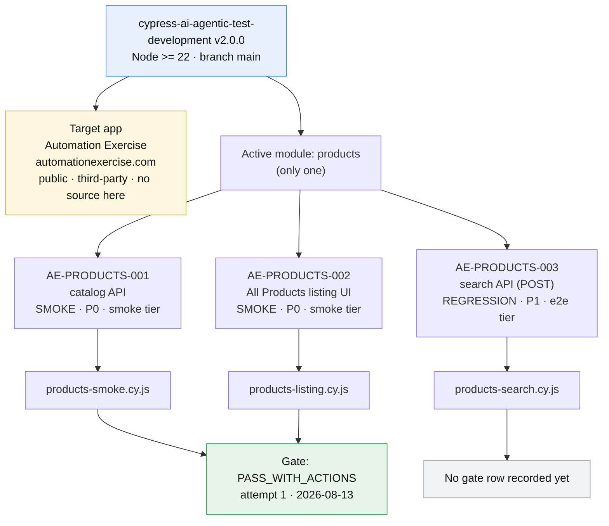

3 active requirements · 3 specs (2 smoke + 1 e2e) · all read-only against a public site · no credentials, no test data created.

---

## 2. Architecture — one direction only

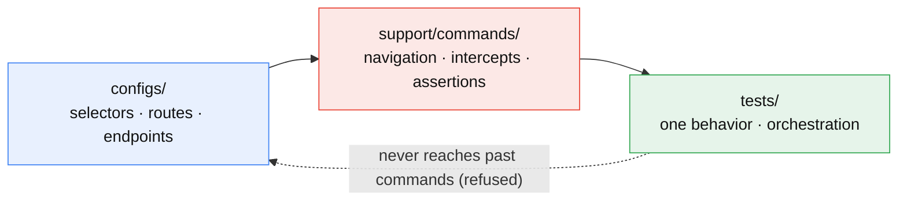

---

## 3. Tier boundary (why AE-PRODUCTS-003 is e2e, not smoke)

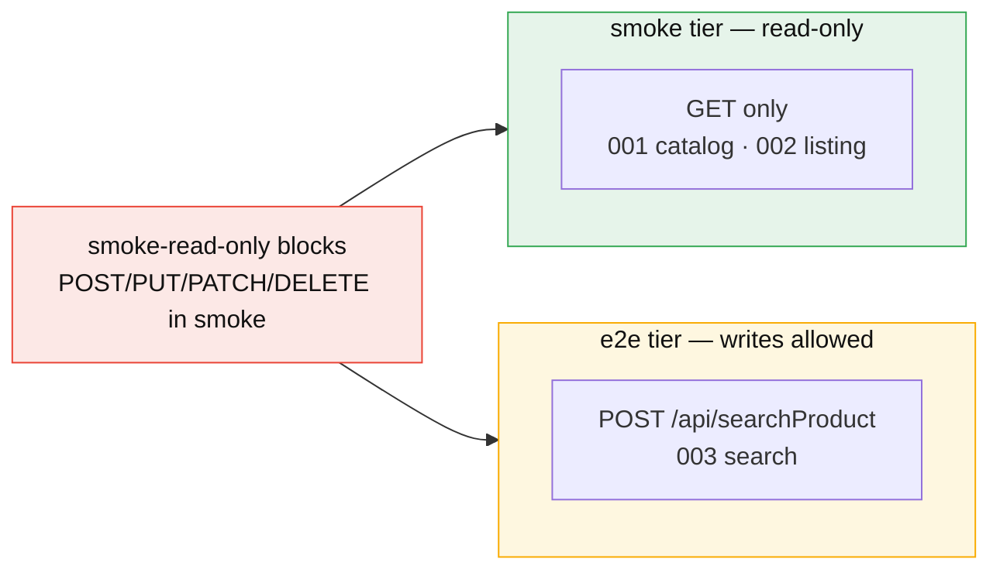

---

## 4. How work flows — 4 agent roles

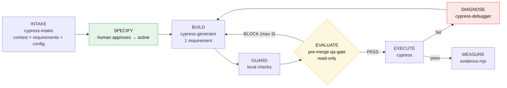

4 roles only: INTAKE · BUILD · DIAGNOSE · EVALUATE. Opening the PR and repo maintenance are done in the
main workflow, not by a dedicated agent. Invoke a specialist only when its `when` condition matches:
INTAKE per new project/module, DIAGNOSE only after a reproducible failure.

---

## 5. The 9 rules at a glance

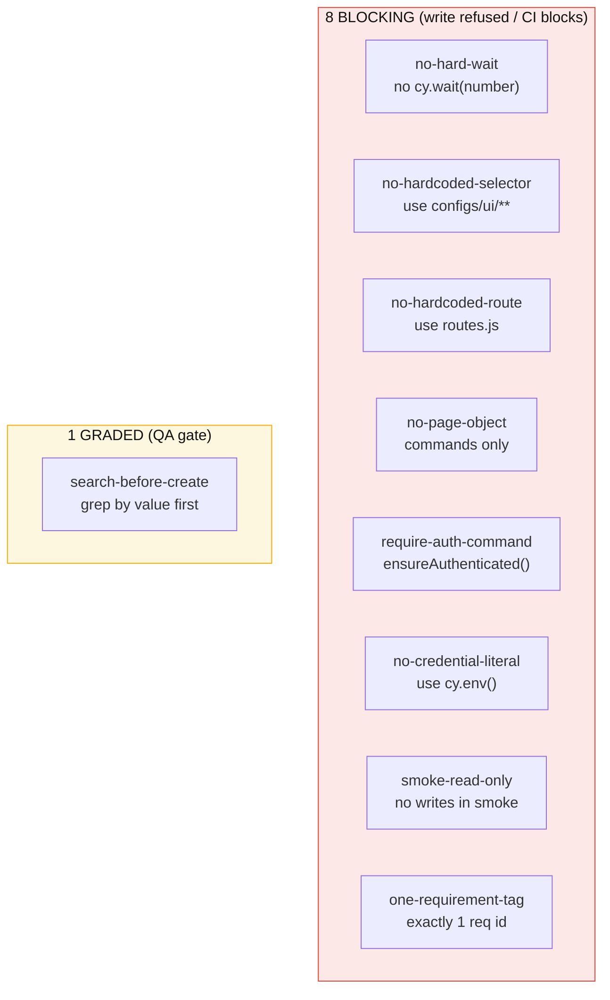

---

## 6. Enforcement — who blocks, and the CI caveat

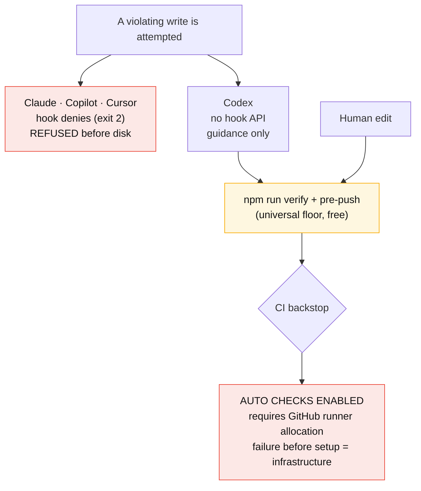

PRs request smoke and architecture validation automatically. Reviewers cannot treat a job that fails
before setup as test evidence; resolve GitHub runner allocation first.

---

## 7. Evidence / metrics — fed vs empty

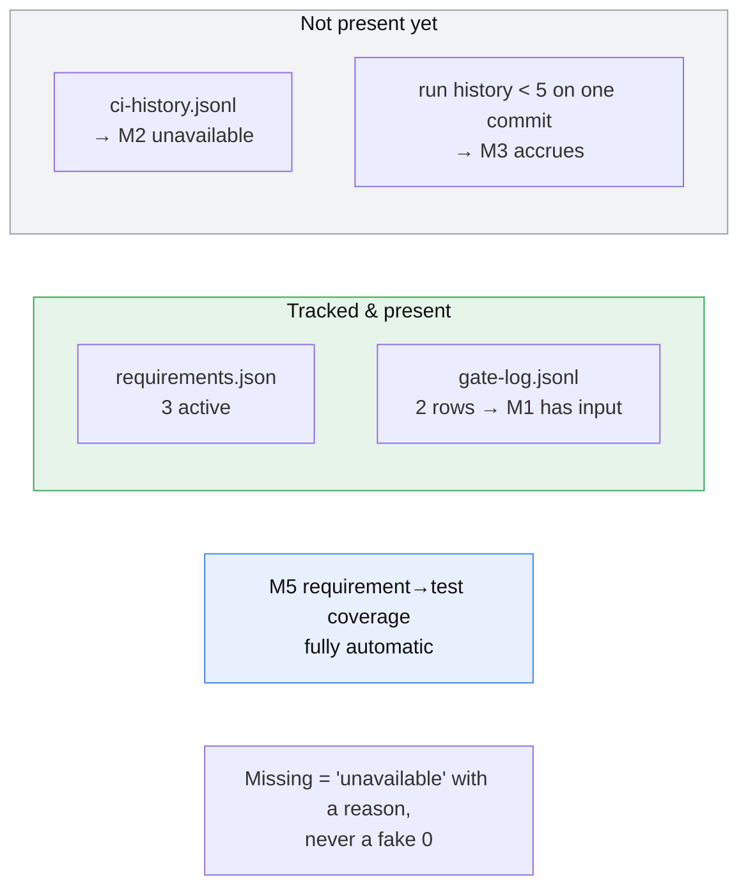

Metrics are M1, M2, M3, M5. (The former manual M4 effort metric has been removed.)

---

## 8. Project profile (what defines this project)

One small profile is the only project-specific input; all rules/roster/policy come from the adapter baseline.

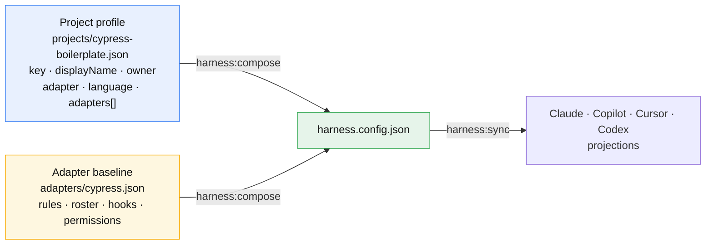

| Field              | Value                                                                       |
| ------------------ | --------------------------------------------------------------------------- |
| key                | `cypress-boilerplate`                                                       |
| displayName        | Cypress Automation Boilerplate                                              |
| profile owner      | `cypress-harness-maintainers` (harness maintainers — **not** the app owner) |
| adapter / language | `cypress` / `javascript`                                                    |
| projectName / repo | `cypress-ai-agentic-test-development`                                       |
| enabled AI tools   | Claude · Copilot · Cursor · Codex (all four, deliberately)                  |

Two different "owners": the profile owner above is the harness maintainers; the **application
accountable owner** is Yagya Bhatta — pending formal confirmation
(`docs/application-intelligence/project-context.md`).

Note for real projects: this repo enables all four tools on purpose, to demonstrate every projection.
A real project should enable only the tools its team actually uses — the `_template` default is
Claude + Copilot — because a disabled adapter's generated files are removed on the next sync.

---

## 9. One representative per project (nominate today)

The repo carries no roster of people. Fill in live.

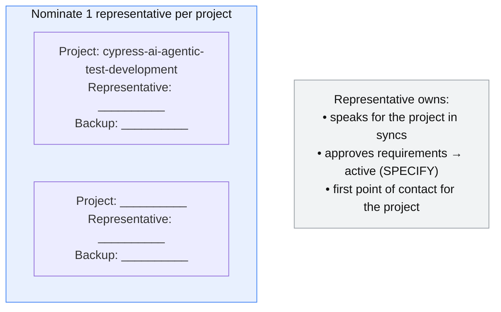

---

## 10. How / who to reach — progress & blockers

Channels and owners are not in the repo — agree and record them in the session.

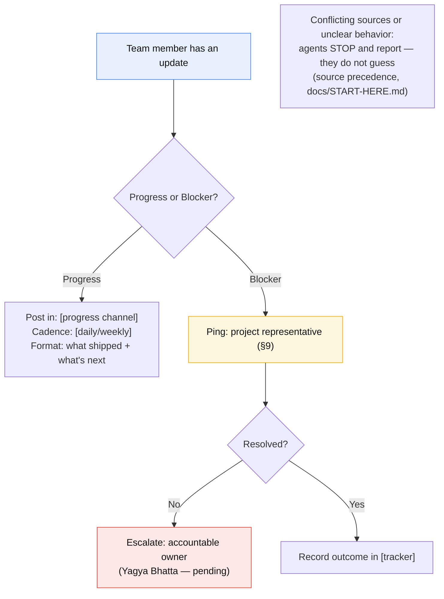

| What                         | Value (to agree)       |
| ---------------------------- | ---------------------- |
| Progress channel + cadence   | TBD                    |
| Blocker / escalation channel | TBD                    |
| Issue tracker / board        | TBD                    |
| Project representative(s)    | TBD (see §9)           |
| Accountable owner (confirm)  | Yagya Bhatta — pending |

---

## 11. Open decisions for the team

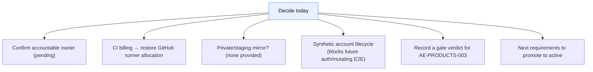

---

## Suggested agenda

1. Repo purpose + Config → Commands → Tests (§2) — 10 min
2. Current state: products module, 3 requirements, 3 specs (§1) + tier boundary (§3) — 10 min
3. Project profile — what defines this project (§8) — 5 min
4. The 9 rules and why (§5) — 10 min
5. Enforcement reality: 3 tools block writes, Codex guidance, CI manual-only (§6) — 5 min
6. Local setup + `npm run verify` live (Node 22 required) — 10 min
7. Nominate one representative per project (§9) — 5 min
8. Agree how/who to reach for progress & blockers (§10) — 10 min
9. Open decisions and owners (§11) — 10 min
